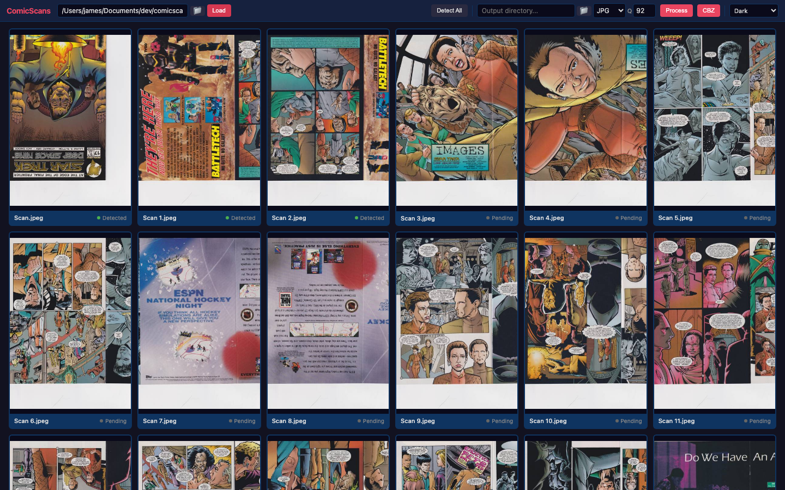
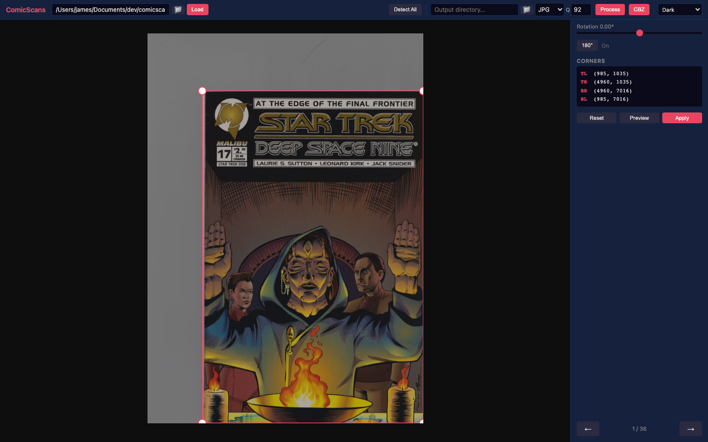
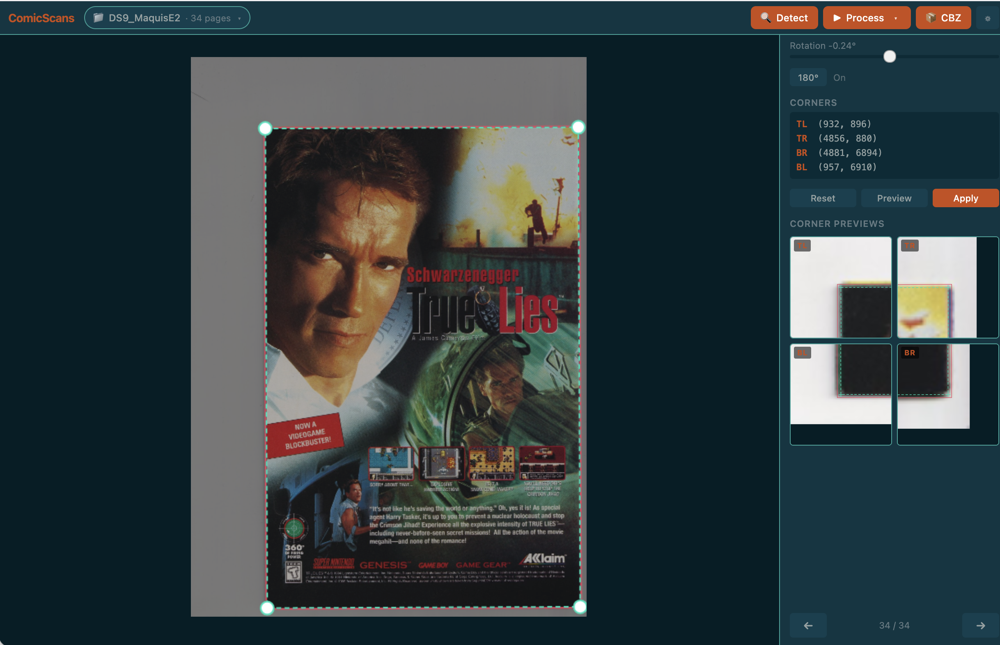

# comicscans

A Python toolkit for converting raw flatbed scanner images of physical comic books into clean, reader-ready CBZ archives. Built to replace manual workflows like ScanTailor Advanced with a fully automated pipeline.

> **Note:** This project was built collaboratively with [Claude](https://claude.ai) (Anthropic's AI assistant), which helped design the architecture, implement the image processing algorithms, and debug the bleed detection system. The commit history reflects this — all commits are co-authored.

> **Note:** This is not useful or intended for piracy. It is useful for making digital archives of comics you physically have. It goes without saying, if you don't have the physical comic you don't have the source images. If you have the source images, you probably already have the comic.

---

## How It Works

```
raw-scans/DS9E17/            comicscans.py              comicpackage.py
 Scan.jpeg    ──┐
 Scan 1.jpeg  ──┤         ┌──────────────┐           ┌──────────────┐
 Scan 2.jpeg  ──┼────────>│  Detect      │           │  QC Checks   │
 ...          ──┤         │  Rotate      │  output/  │  ComicInfo   │   .cbz
 Scan 35.jpeg ──┘         │  Deskew      ├──────────>│  Package     ├──────>
                          │  Crop        │  DS9E17/  │              │
                          │  Normalize   │           └──────────────┘
                          └──────────────┘
```

The workflow is split so you can inspect processed pages before packaging, and re-package with different metadata without reprocessing.

| Tool | Purpose |
|------|---------|
| `webapp/scan/` | Interactive scan UI (port 8000) — visual crop editing, batch processing, CBZ packaging with ComicVine metadata |
| `webapp/train/` | Training dashboard (port 8001) — launch runs, watch live loss curves, browse ground truth, evaluate models |
| `comicscans.py` | CLI image processing: page detection, rotation, deskew, bleed removal, normalization |
| `comicpackage.py` | CLI quality control, ComicInfo.xml metadata, CBZ archive creation |
| `comiceval.py` | Ground-truth evaluation and parameter tuning against manual crop corrections |
| `comicml/` | Hybrid detector package: 5-model ResNet-18 ensemble + line-fit edge refinement (~16 px mean / ~24 px p95 single-model on holdout) |
| `lessons.md` | Running log of empirical training findings — read before launching a new training run |

---

## Installation

```bash
pip install -r requirements.txt

# Optional external dependency (required for CLI --auto-rotate)
brew install tesseract
```

`requirements.txt` covers everything: core processing (OpenCV, Pillow, NumPy), the web app (FastAPI, Uvicorn), parameter tuning (scipy), and the hybrid CNN detector (PyTorch, torchvision). Python 3.10+.

---

## Scanner Setup

Designed for the Canon LiDE 300 flatbed scanner (and similar models):

- Place the comic page in the **top-left corner** of the scanner bed
- Scan at **300 DPI** or **600 DPI** (both supported — the pipeline auto-scales)
- The pipeline automatically handles scanner bed margins, off-white bed color (~228–243 grayscale), two-page bleed from open bindings, and slight skew from page placement

Raw scans must be named `Scan.jpeg`, `Scan 1.jpeg`, `Scan 2.jpeg`, etc. (front cover is `Scan.jpeg`, then sequentially numbered). JPEG, PNG, TIFF, and BMP are supported.

---

## Quick Start

The easiest path is the web app:

```bash
python3 webapp/scan/server.py
# Opens at http://localhost:8000
```

For the training dashboard (only needed when you're working on the ML model):

```bash
python3 webapp/train/server.py
# Opens at http://localhost:8001
```

Load a directory, detect all pages, adjust any that need fixing, process, and package — all in the browser.

CLI equivalent for a fully scripted workflow:

```bash
# 1. Process raw scans
python3 comicscans.py raw-scans/DS9E17/ --auto-rotate --rotate 1

# 2. Package into a CBZ
python3 comicpackage.py output/DS9E17/ \
  --title "The Secret of the Lost Orb" \
  --series "Star Trek: Deep Space Nine" \
  --number 17 --year 1994 --month 11 \
  --publisher "Malibu Comics" --language en
```

Output: `output/Star Trek: Deep Space Nine-issue_017-(1994).cbz`

---

## Web App

The web app provides an interactive UI for the entire scanning workflow. Load a directory of raw scans, visually adjust crop boundaries and rotation, batch-process everything, and package the result into a CBZ.

### Grid View

Thumbnails of all loaded scans with detection status badges. Click any page to open the editor.



### Editor View

Per-page controls for rotation, 180° flip, and corner adjustment. Drag the corner handles to fine-tune crop boundaries. Changes auto-save to a session file in the input directory.



### Corner Previews

Four zoomed-in thumbnails (TL/TR/BR/BL) show the detected and crop corners live as you edit — so you can verify alignment without zooming around the main image. Overlay colors and line styles (solid/dashed/dotted) are configurable in settings.



### Features

- **Directory browser** — built-in file picker for input/output paths (no OS dialog needed)
- **Auto-detection** — detect page bounds for all scans in one click
- **Visual crop editor** — drag corner handles with zoom lens for precision; real-time rotation preview
- **Session persistence** — detections and manual overrides saved to `.comicscans_session.json` in the input directory, restored automatically on reload
- **Clear Cache** — button (with confirmation) to wipe stale detections and overrides for the current directory
- **Batch processing** — process all pages to JPG or WebP at configurable quality
- **CBZ creation** — search ComicVine for series/issue metadata, review and edit fields, package into a CBZ archive
- **Themes** — Dark, Light, Solarized, Cyberpunk, and Dune color schemes

---

## CLI: comicscans.py

```
python3 comicscans.py <input_dir> [options]
```

| Flag | Description |
|------|-------------|
| `--output`, `-o` | Output directory (default: `output/<input_name>`) |
| `--format`, `-f` | Output format: `jpg` or `webp` (default: `jpg`) |
| `--quality`, `-q` | Image quality 1-100 (default: 85) |
| `--preview`, `-p` | Preview first, middle, and last pages before saving |
| `--auto-rotate` | Auto-detect upside-down pages using Tesseract OCR |
| `--rotate` | Rotate specific pages 180° (e.g., `2,4,6` or `2-8`) |
| `--rotate-range` | Rotate a range of pages 180° (e.g., `2-14`) |
| `--rotate-even` | Rotate all even-numbered pages 180° |
| `--rotate-odd` | Rotate all odd-numbered pages 180° |
| `--model` | Path to trained CNN checkpoint (enables hybrid CNN+classical detector) |

### Examples

```bash
# Basic processing (no rotation correction)
python3 comicscans.py raw-scans/DS9E17/

# Auto-detect orientation + manually fix one page
python3 comicscans.py raw-scans/DS9E17/ --auto-rotate --rotate 1

# Rotate all even pages (alternating scan pattern)
python3 comicscans.py raw-scans/DS9E17/ --rotate-even

# Preview before saving
python3 comicscans.py raw-scans/DS9E17/ --auto-rotate --preview

# WebP output for smaller file size
python3 comicscans.py raw-scans/DS9E17/ --auto-rotate --format webp --quality 75
```

---

## CLI: comicpackage.py

```
python3 comicpackage.py <pages_dir> [metadata options]
```

| Flag | Description |
|------|-------------|
| `--interactive`, `-i` | Prompt for each metadata field |
| `--qc-only` | Run QC checks only, don't package |

Metadata flags: `--title`, `--series`, `--number`, `--volume`, `--year`, `--month`, `--day`, `--writer`, `--penciller`, `--inker`, `--colorist`, `--letterer`, `--editor`, `--publisher`, `--web`, `--language`, `--characters`, `--teams`, `--locations`

### Examples

```bash
# Full metadata via CLI
python3 comicpackage.py output/DS9E17/ \
  --title "The Secret of the Lost Orb" \
  --series "Star Trek: Deep Space Nine" \
  --number 17 --year 1994 --month 11 \
  --writer "Laurie S. Sutton" \
  --penciller "Leonard Kirk" \
  --inker "Jack Snider" \
  --publisher "Malibu Comics" --language en

# Interactive mode
python3 comicpackage.py output/DS9E17/ --interactive

# QC only (no packaging)
python3 comicpackage.py output/DS9E17/ --qc-only
```

---

## Evaluation & Parameter Tuning

Every manual crop correction in the web app is a labeled example of where the detector got it wrong. `comiceval.py` harvests those corrections from `.comicscans_session.json` files and uses them as ground truth for measuring accuracy and tuning detection parameters.

```bash
# Collect ground truth from all processed scan directories
python3 comiceval.py collect raw-scans/

# Evaluate current detection accuracy
python3 comiceval.py eval

# Tune parameters to minimize mean corner distance
python3 comiceval.py tune

# Compare against tuned params
python3 comiceval.py eval --params comiceval_params.json

# Audit: run the hybrid detector across ground truth and flag pages
# whose GT corners look mis-clicked (model nails 3 corners, disagrees on
# one, and that one is geometrically inconsistent with the rectangle
# formed by the other three). Advisory list — verify in the webapp.
python3 comiceval.py audit
```

The tuner uses Nelder-Mead optimization (scipy) with preloaded images in memory. Best-so-far parameters are saved on every improvement, so long runs can be interrupted safely.

Run `audit` after every new batch of ground-truth collection — the heuristic is advisory (real corner damage can false-positive), but it catches genuine mis-clicks efficiently.

---

## Hybrid CNN Detector

Classical detection hit a structural ceiling around 117 px mean corner error. The `comicml/` package replaces it with a two-stage hybrid detector:

1. **CNN stage** — a 5-model ResNet-18 ensemble (768×768 input) regresses all four page corners directly. Members are trained on incrementally larger ground-truth slices (956 → 1000 → 1420 → 1589 → 1702 corrected pages) so each makes different mistakes, and predictions are averaged per-corner. Test-time augmentation (horizontal flip + average) runs inside each member for extra variance reduction. Best individual members use cosine warm-restart AdamW over 280 epochs.

2. **Line-fit refinement** — samples ~30 gradient profiles along each predicted page edge, RANSAC-fits a line through confident detections, and intersects adjacent lines for corner coordinates. Falls back to per-corner snap when the line fit disagrees with independent per-corner evidence (agreement gating prevents catastrophic failures from spurious edges on bleed-heavy pages). Adaptive skip uses per-corner TTA disagreement to bypass refinement when the CNN is highly confident.

The strongest single member achieves **~16.3 px mean corner error** on the 114-page DS9 holdout (median 15.8, P95 23.5, max 38.6). The 5-model ensemble brings tail metrics down further by averaging out uncorrelated outliers — see `lessons.md` for run-by-run history and tuning notes.

```bash
# Train a new ensemble member. The defaults match the recipe documented in
# lessons.md (768 input, 280 epochs, warm restarts T_0=40, seed=137). Vary
# the seed to diversify the ensemble.
python3 -m comicml.train train \
    --output comicml_model_reg_768_<dataset>pg_e280.pt \
    --input-size 768 --epochs 280 --warm-restarts 40 --seed 137

# Evaluate a model on its embedded holdout (uses TTA flip averaging)
python3 -m comicml.train eval --model comicml_model_reg_768_1702pg_e280.pt

# Use hybrid detector from the CLI
python3 comicscans.py raw-scans/DS9E17/ --auto-rotate
```

Active ensemble membership is configured by `models/ensemble_config.json`. The
scan webapp reads this on startup; restart it after editing to pick up
changes. The training dashboard's Model Management tab can edit it
interactively.

---

## Processing Pipeline

### Step 1: Load & Sort

Scans are loaded from the input directory, sorted by page index, and checked for gaps. DPI is read from image metadata (defaults to 300).

### Step 2: Orientation Correction

Pages are rotated 180° as needed. With `--auto-rotate`, Tesseract OCR runs on both the normal and flipped image, counting recognized English words. If the flipped version produces 15%+ more words, the page is upside-down. Manual `--rotate` flags take precedence.

### Step 3: Two-Page Bleed Detection

When a comic is opened on a flatbed scanner, the adjacent page is often partially visible. The pipeline detects and removes this bleed using a layered strategy:

1. **Dark spine shadow** — very dark, uniform vertical bands from the binding
2. **Bright gutter** — white page margin between the two visible pages
3. **Dark trough** — subtle brightness dip (lighter than a full spine shadow)
4. **Gradient detection** — sharpest brightness transition, weighted toward the expected position
5. **Expected width fallback** — uses standard comic page width (6.625") at the scan DPI
6. **Secondary trim** — if the page is still too wide after the primary cut, trims the opposite edge

The bleed side (left vs. right) is determined by scanner bed margin position: bottom margin indicates a non-rotated page (bleed on right), top margin indicates a rotated page (bleed on left).

### Step 4: Deskew

Hough line detection on the outer border regions finds near-horizontal and near-vertical edges. Lines are length-weighted and the median angle is used. Only small corrections (0.1°–5°) are applied — flatbed scans never need large rotation.

### Step 5: Crop & Normalize

Pages are cropped to their detected boundaries, then center-composited onto a uniform canvas (median width × median height across all pages). No rescaling — native resolution is preserved.

### Step 6: Save

Pages are saved as JPEG or WebP with the specified quality. JPEG preserves DPI metadata; WebP typically produces 30–50% smaller files at equivalent visual quality.

---

## Quality Control Checks

The packager runs 8 automated checks before creating the CBZ:

| Check | What it detects |
|-------|-----------------|
| Page count | Warns if outside 24–48 range |
| Dimensions | Flags inconsistent page sizes |
| File size outliers | Z-score > 2.5 sigma from mean |
| Blank pages | Low pixel standard deviation |
| Duplicates | Perceptual hash comparison (hamming distance < 5) |
| JPEG integrity | Corrupt or unreadable files |
| Spine remnants | Dark vertical bands from incomplete bleed removal |
| Orientation suspects | Dark top edge + light bottom (possible upside-down) |

---

## CBZ Output Format

The CBZ archive is a ZIP file (using `ZIP_STORED` — no compression, since JPEGs are already compressed) containing:

```
Star Trek: Deep Space Nine-issue_017-(1994).cbz
├── ComicInfo.xml
└── DS9E17/
    ├── Scan 0.jpg
    ├── Scan 1.jpg
    ├── ...
    └── Scan 35.jpg
```

`ComicInfo.xml` follows the [ComicRack schema](https://anansi-project.github.io/docs/comicinfo/intro) with auto-generated page metadata (dimensions, file size, front cover designation).

---

## License

Personal-use tooling for digitizing a physical comic book collection. No comic book content is included in this repository.
